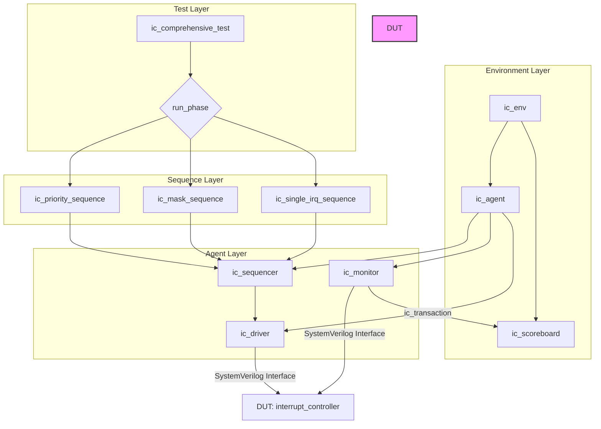

# 🛡️ UVM Testbench for an 8-bit Priority Interrupt Controller


A comprehensive UVM (Universal Verification Methodology) verification environment designed to rigorously test an 8-bit priority-based interrupt controller. This project showcases a complete, industry-standard verification workflow from test planning to functional validation.

---

## 🚀 Project Overview

This repository contains the RTL design for a priority interrupt controller and a complete UVM testbench built to verify its functionality. The controller manages eight interrupt requests (IRQ0-IRQ7), prioritizing them and interfacing with a processor. The verification environment is built to be robust, reusable, and scalable.

## ✨ Key Features

### RTL (Design Under Test)
- **8-bit Interrupt Handling**: Manages up to 8 interrupt sources.
- **Fixed Priority Scheme**: IRQ0 has the highest priority, and IRQ7 has the lowest.
- **Interrupt Masking**: Features a configurable mask register to enable/disable specific interrupts.
- **Pending Register**: Latches incoming interrupt requests until they are acknowledged.
- **Processor Handshake**: Simple `irq_out` and `ack` interface for processor communication.

### UVM Testbench
- **Layered & Reusable Architecture**: Follows UVM best practices for modularity and scalability.
- **Comprehensive Test Suite**: Includes directed, constrained-random, and regression tests.
- **Advanced Monitoring**: Utilizes edge-based detection for precise event capture.
- **Reference Model & Scoreboard**: Provides accurate, cycle-by-cycle DUT behavior validation.

---

## 🏗️ Verification Architecture

The testbench follows a standard UVM layered architecture to ensure separation of concerns and reusability.



---

## 📂 File Structure

The project is organized into design, verification, and build files.

```
.
├── 📜 uvm_design.sv              # RTL: Complete design implementation
├── 🔬 uvm_testbench.sv           # UVM: Complete verification environment
├── 📝 UVM_Project_Report.tex     # Documentation: Detailed project report
├── 🛠️ Makefile                   # Build: Automation for compilation and simulation
├── 🚀 run_*.sh / .bat           # Scripts: Test execution helpers
└── 📖 README.md                  # This file
```

---

## ⚙️ Getting Started

### Prerequisites

- A SystemVerilog-2012 compliant simulator (e.g., Mentor QuestaSim, Synopsys VCS, Cadence Xcelium).
- UVM 1.2 library (usually bundled with modern simulators).
- `make` for running automated builds.

### 🚀 Quick Start: Compilation & Simulation

1.  **Clone the repository:**
    ```bash
    git clone https://github.com/HasanQarmash/UVM-chip-verification.git
    cd UVM-chip-verification
    ```

2.  **Compile the environment:**
    This command compiles both the DUT and the testbench.
    ```bash
    make compile
    ```

3.  **Run the comprehensive regression test:**
    This runs a full suite of tests to validate the core functionality.
    ```bash
    make run_uvm_test
    ```
    You should see a `*** ALL TESTS PASSED ***` message from the scoreboard at the end of the simulation log.

### 🧪 Running Specific Tests

The Makefile provides targets for running individual test scenarios:

-   `make run_single_irq`: Verifies each interrupt line individually.
-   `make run_priority`: Tests the priority logic with competing interrupts.
-   `make run_mask`: Checks the functionality of the interrupt mask register.

### 🖥️ Waveform Debugging

To open the simulator in GUI mode and view waveforms:
```bash
make gui
```
This will generate a `uvm_waves.vcd` file that can be loaded into a waveform viewer.

---

## 🎯 Verification Strategy & Results

The verification strategy aims for 100% functional coverage of the DUT's features.

-   **Verification Goals**:
    -   [✔️] Verify interrupt prioritization.
    -   [✔️] Verify interrupt masking.
    -   [✔️] Verify pending register latching and clearing.
    -   [✔️] Verify reset behavior.
    -   [✔️] Test boundary conditions (e.g., all interrupts asserted simultaneously).

-   **Results Summary**:
    -   All defined test cases pass.
    -   The scoreboard reports zero mismatches.

---

## 🤝 Contributing

Contributions are welcome! If you have suggestions for improvements or find any issues, please feel free to open an issue or submit a pull request.

1.  Fork the Project.
2.  Create your Feature Branch (`git checkout -b feature/AmazingFeature`).
3.  Commit your Changes (`git commit -m 'Add some AmazingFeature'`).
4.  Push to the Branch (`git push origin feature/AmazingFeature`).
5.  Open a Pull Request.

---

## 📜 License

This project is distributed under the MIT License. See the `LICENSE` file for more information.

---

## 📧 Contact

Hasan Qarmash - [LinkedIn](https://www.linkedin.com/in/hasan-qarmash-b27343247/)

Project Link: [https://github.com/HasanQarmash/UVM-chip-verification](https://github.com/HasanQarmash/UVM-chip-verification)
